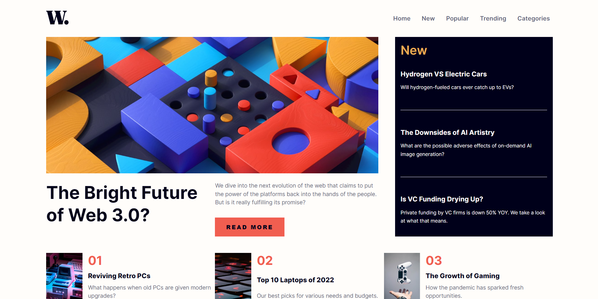

# Página de inicios de noticias

_"Este proyecto es una propuesta de solución para uno de los desafios de Frontend Mentor, todos los recursos utilizados fueron obtenidos mediante dicha plataforma"_

El contenido de este repositorio contempla el desarrollo de una página web que muestra una sección de inicio de noticias de distintos temas, de manera que el contenido se muestre entendible y distribuido de manera ordenada para cada dispositivo que visite esta página.

## Contenidos

- [Descripción](#descripción)
  - [Desafío](#desafío)
  - [Screenshot](#screenshot)
  - [Links](#links)
- [Proceso](#proceso)
  - [Hecho con](#hecho-con)
  - [Lo que aprendí](#lo-que-aprendí)

## Descripción

### Desafío

El desafio propuesto fue diseñar un página de inicio _responsive_ y accesible para todos los usuarios, de manera que utilizando teclas como _tab_ o las flechas direccionales podrán navegar por la página sin problemas.

### Screenshot

#### Escritorio

#### Movil

### Links

- Sitio: [-](#)

## Proceso

### Hecho con

- HTML
- CSS
  - Flexbox
  - CSS
  - Flujo de trabajo _Mobile-first_
- JavaScript

### Lo que aprendí

Para esta ocasión aprendi a manejar el contenido de un menu de navegación _responsive_ (ya sea la lista completa de páginas en dispositivos convencionales o presionar un botón que puede mostrar u ocultar el menú de navegación), esto además utilizando etiquetas semanticas para dar un mayor contexto a mi documento HTML.

Para esta página en particular utilicé JavaScript para generar dinámicamente un contenedor que actuara como _overlay_ al momento de abrir el menú de navegación en dispositivos móviles, esto con el fin de enfocar más el interés sobre el menú de navegación que por el contenido de la página mientres esté activo.

Tambien reforcé varias técnicas aprendidas anteriormente sobre el uso de Media Queries para adaptar el contenido en ciertas resoluciones, el uso de fuentes dinámicas, accesibilidad, etc.

